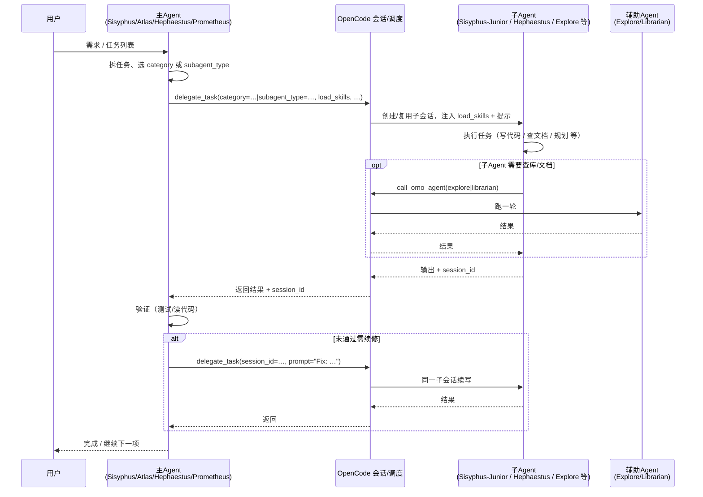
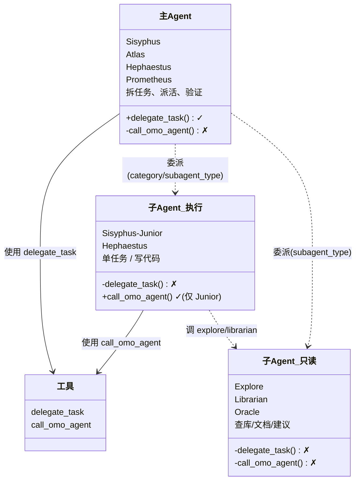

# OMO 多 Agent 体系总结

> 从框架与协作视角概括 OMO 如何在 OpenCode 之上形成多 Agent 编排体系，不涉及实现细节。

**OMO 多 Agent 怎么工作（一句话）**：用户对**主编排**（如 Sisyphus、Atlas）说话 → 主编排拆任务，用 **delegate_task** 把工作派给**子 Agent**（如 Sisyphus-Junior、Explore）→ 子 Agent 执行（需要查库/文档时可用 **call_omo_agent** 调 explore/librarian）→ 结果返回主编排，**验证**；未通过则用 **session_id** 让同一子 Agent 续修。系统在消息与工具执行前后通过 **Hook** 注入“必委托、必验证、按计划继续”等提醒，与主 Agent 的 prompt 一起形成闭环。**OpenCode** 提供会话与调度能力，OMO 作为插件在其上注册这些 Agent、工具与 Hook。

---

## 一、OMO 与 OpenCode 的关系：插件式泛化

OMO **不替换** OpenCode，而是作为**插件**在其契约上做扩展，具体体现在以下三类“更多”：**更多 Agent**、**更多工具**、**贯穿生命周期的策略**。下面分别列出具体项。

---

### 1.1 具体的 Agent（OMO 注入到 OpenCode 的）

| Agent 名称 | 角色/用途 |
|------------|-----------|
| **Sisyphus** | 主编排：拆任务、委托、验证；默认主 Agent |
| **Atlas** | Boulder 编排：持任务列表，只委托、不亲手改业务代码 |
| **Hephaestus** | 深度实现者：被委托写/改代码 |
| **Prometheus** | 规划：写计划、拆步骤；可替代 OpenCode 的 plan |
| **Sisyphus-Junior** | 被派发的执行者：由 delegate_task(category=…) 创建，做单任务；可 call_omo_agent 调 explore/librarian |
| **Oracle** | 咨询与调试建议：只读 + 建议 |
| **Librarian** | 查外部/文档：只读与搜索 |
| **Explore** | 查当前代码库：只读与搜索 |
| **Multimodal-Looker** | 看图/PDF 等：仅只读 |
| **Metis** | 规划前顾问：需求澄清、给规划者指令 |
| **Momus** | 计划审稿：审已有计划是否可执行 |
| **OpenCode-Builder**（可选） | 与 OpenCode 原 build 一致的单 Agent，可选加入列表 |
| **build / plan** | 被 OMO 改写：build 降为 subagent+hidden；plan 指向 Prometheus 副本 |

上述 Agent 通过 **config Hook** 注入 `config.agent`，并设置 `config.default_agent`（如 `sisyphus`），出现在会话可选列表与工具调用的上下文中。

---

### 1.2 具体的工具（OMO 注册或强相关的）

| 工具名 | 用途 |
|--------|------|
| **delegate_task** | 任务委派：按 category 或 subagent_type 派给子 Agent，支持 load_skills、session_id、run_in_background |
| **call_omo_agent** | 类似「调一个 Agent」的 API：指定某个 agent 跑一轮，**单独结束**（该次调用跑完即返回结果）；当前 Agent 拿到结果后继续。常以后台会话执行，不涉及 session_id 续写等委派生命周期。 |
| **task** | OpenCode 新任务系统（可选）；OMO 在 tool.execute 前后对其做权限/限制 |
| **skill** | 执行 Skill（本地/OpenCode 规范） |
| **skill_mcp** | Skill 关联的 MCP |
| **slashcommand** | 执行斜杠命令（含内置与加载的 Command/Skill）；OMO 处理 ralph-loop、ulw-loop 等 |
| **background_output / background_cancel** | 后台任务输出与取消，与 delegate_task 后台体系打通 |
| **look_at** | 多模态查看（可配置禁用） |
| **builtinTools**（OMO 提供） | lsp_*、ast_grep_*、grep、glob、session_* 等 |

由 OpenCode 在对话中按 **Agent 的 permission** 下发；OMO 通过 config 与 permission 控制谁可用 delegate_task / call_omo_agent 等。

**delegate_task 与 call_omo_agent 的区别与应用**（两者都是多 Agent 调用工具，语义与权限不同）：

- **语义**：delegate_task = 主 Agent 把一整块任务委派给子 Agent（派活），支持 load_skills、session_id 续写、run_in_background 等完整委派语义；call_omo_agent = 类似**调一个 Agent 的 API**：指定 agent 跑一轮、**单独结束**（该次调用结束即返回），结果塞回当前上下文，一次性、不续写，常后台。
- **典型使用者**：delegate_task 由 Sisyphus、Atlas、Hephaestus、Prometheus 等主编排/主执行 Agent 使用；call_omo_agent 由 **Sisyphus-Junior** 使用——被派活后需要查代码/文档时调 explore 或 librarian。
- **权限设计**：主 Agent 允许 delegate_task、多数禁止 call_omo_agent；Sisyphus-Junior **禁止 delegate_task**（避免链式委托）、**允许 call_omo_agent**（实现 subagent 调 subagent）。
- **怎么选**：要“派任务、建子会话、带 load_skills、可续写” → delegate_task；要“当前步骤里请某专家帮个忙（查库、查文档）” → call_omo_agent。效果：主编排用 delegate_task 派活，被派活的 Sisyphus-Junior 不能再用 delegate_task 派活，但可用 call_omo_agent 调 explore/librarian 做调研，既避免链式委托又保留子 Agent 的“找人帮忙”能力。

---

### 1.3 具体的贯穿生命周期的策略（Hook 节点与注入内容）

策略通过 **Hook** 挂到消息与工具执行链路上，在对应节点注入规则或提醒。

**Hook 节点与挂载的逻辑（代表项）：**

| 节点 | 策略/逻辑（代表） | 作用 |
|------|-------------------|------|
| **chat.message** | keywordDetector、autoSlashCommand、firstMessageVariantGate、agentUsageReminder、ralphLoop、startWork 等 | 消息进入时：关键词检测、自动斜杠、变体门控、Agent 使用提醒、循环模板识别 |
| **tool.execute.before** | rulesInjector、directoryAgentsInjector、directoryReadmeInjector、prometheusMdOnly、sisyphusJuniorNotepad、atlasHook；对 task 限制子 Agent 的 delegate_task/call_omo_agent | 工具执行前：注入规则与目录 Agent/README、Prometheus 只写 .md、Atlas/Sisyphus-Junior 专用逻辑、子会话权限约束 |
| **tool.execute.after** | toolOutputTruncator、commentChecker、emptyTaskResponseDetector、agentUsageReminder、categorySkillReminder、delegateTaskRetry、atlasHook、taskResumeInfo、editErrorRecovery | 工具执行后：输出截断、注释检查、空任务检测、委托/技能提醒、重试与续写信息、Atlas 续推 |

**注入到上下文中的“策略名称”（示例）：**

- **ORCHESTRATOR_DELEGATION_REQUIRED**：要求主编排必须通过委托派活，而非自己包办。
- **VERIFICATION_REMINDER**：委托完成后必须先验证再标记完成。
- **BOULDER_CONTINUATION**：还有未完成任务，请验证当前项、打勾、再继续下一项（Boulder/Atlas 模式）。

整体效果：在**消息到达、工具执行前后**等节点，把“只委托、必验证、按计划继续”等规则压进当前上下文，与主 Agent 的 prompt 配合形成闭环。

---

### 1.4 小结

因此，**“泛化”** = 在 OpenCode 的会话与调度之上，增加**上列具体 Agent**、**上列具体工具**、以及**上列贯穿生命周期的 Hook 与策略**；**执行与调度仍由 OpenCode 完成**，OMO 只提供配置与行为定义。

---

## 二、多 Agent 协作策略（单独说明）

第一节 1.3 列出了“有哪些 Hook 节点、注入哪些策略名称”；本节只对**与多 Agent 协作直接相关**的那几条策略做「含义 → 目的 → 如何落实」的展开，便于查阅和改配置。

### 2.1 策略总表

| 策略要点 | 含义 | 目的 | 如何落实 |
|----------|------|------|----------|
| **主编排必须委托、不包办** | 实现类工作（写代码、改代码）通过 delegate_task 交给子 Agent，主 Agent 负责拆任务、派活、验证，不亲手写业务代码 | 角色清晰、可并行、责任可追溯 | 主 Agent prompt（如 “DELEGATE by default”）+ hook 注入 **ORCHESTRATOR_DELEGATION_REQUIRED** |
| **委托必须带 load_skills** | 每次 delegate_task 都要传本次任务需要的 skill 列表（可为 []），OMO 把对应 SKILL 正文注入子会话 system | 子 Agent 一上来就带齐本次任务说明，行为可预期 | 主 Agent prompt 中 Delegation Check 要求必须传 load_skills；公共片段 buildCategorySkillsDelegationGuide 提供选表 |
| **委托完成后必须验证** | 主 Agent 收到子 Agent 返回后，要先验证（跑测试、读代码、诊断）再标记完成；未通过则让同一子 Agent 续修 | 减少“子 Agent 说做完其实没做完”的虚假完成 | 主 Agent prompt（“AFTER THE WORK YOU DELEGATED SEEMS DONE, ALWAYS VERIFY…”）+ hook **VERIFICATION_REMINDER** |
| **必须保存并用 session_id 续写** | 每次 delegate_task 返回的 session_id 要存下来；续写或修 bug 时必须把该 session_id 传给下一次 delegate_task，在同一子会话内继续 | 同一子 Agent 多轮修改、修 bug 不丢上下文 | 主 Agent prompt（“STORE the session_id”、续写必传、失败时 prompt="Fix: ..."） |
| **子 Agent 禁止再委托** | Sisyphus-Junior 等执行类子 Agent 不能调用 delegate_task / task，只能做单任务或 call_omo_agent | 避免 A→B→C 链式委托，控制调用深度、编排可控 | **permission** 对子 Agent 将 delegate_task/task 设为 deny；Sisyphus-Junior 的 **BLOCKED_TOOLS**、**SINGLE_TASK_ONLY** 语义 |
| **子 Agent 可用 call_omo_agent 调 explore/librarian** | 执行类子 Agent（仅 Sisyphus-Junior）允许 call_omo_agent，用于当前步骤里请 explore/librarian 查库、查文档 | 既禁止链式委派，又保留“找人帮忙”的调研能力 | permission 对 Sisyphus-Junior 允许 call_omo_agent；主 Agent 多数禁止 call_omo_agent |
| **按计划继续（Boulder）** | 有未完成任务时，在适当时机注入“还有 N 项未完成，请验证当前项、打勾、再继续下一项” | 任务列表闭环：计划 → 执行 → 验证 → 打勾 → 下一项 | hook **BOULDER_CONTINUATION** + Atlas 相关 prompt 与计划文件（.sisyphus/tasks 等） |
| **禁止自委托、禁止 delegate 给 primary** | 不能把任务派给自己或派给当前会话的主 Agent（primary） | 避免无效或循环调用 | delegate_task 执行层校验（OMO/OpenCode） |
| **不稳定模型强制后台** | 某些模型或场景下委托时强制 run_in_background，不阻塞主会话 | 主会话不长时间等待，体验与稳定性更好 | 执行层/配置（按模型或 category 决定是否强制后台） |
| **explore/librarian 用 subagent_type + 常后台** | 查代码库、查文档的委托用 subagent_type 指名 explore/librarian，并建议 run_in_background | 主 Agent 并行收集信息、不干等 | 主 Agent prompt 中的示例与规则（如 Sisyphus、Hephaestus） |

### 2.2 策略分组小结

- **委托侧**：必须委托不包办、必须 load_skills、选人用 category/subagent_type、explore/librarian 常后台 → 保证“谁来做、带什么上下文、怎么并行”清晰。
- **验证与续写**：必验证再标记完成、必存 session_id 并用于续写/修 bug、Boulder 按计划继续 → 保证“做完是真的、可续修、任务列表闭环”。
- **约束与安全**：子 Agent 禁止再委托、仅 Junior 可 call_omo_agent、禁止自委托/禁止 delegate 给 primary、不稳定模型强制后台 → 保证调用深度可控、无无效调用。

### 2.3 多 Agent 协作相关提示词摘录

以下为源码中与多 Agent 协作**直接相关的提示词原文**摘录（出处：`fuyao-opencode-omo/src`），便于对照策略与实现。

**（1）主 Agent prompt 中的协作片段**

- **Sisyphus**（`agents/sisyphus.ts`）  
  - **Delegation Check（委托前必做）**  
    > **Delegation Check (MANDATORY before acting directly):**  
    > 1. Is there a specialized agent that perfectly matches this request?  
    > 2. If not, is there a `delegate_task` category that best describes this task? (visual-engineering, ultrabrain, quick etc.) What skills are available? **MUST FIND skills to use**, for: `delegate_task(load_skills=[{skill1}, ...])` **MUST PASS SKILL AS DELEGATE TASK PARAMETER.**  
    > 3. Can I do it myself for the best result, FOR SURE? **Default Bias: DELEGATE. WORK YOURSELF ONLY WHEN IT IS SUPER SIMPLE.**  
  - **委托后必验证**  
    > **AFTER THE WORK YOU DELEGATED SEEMS DONE, ALWAYS VERIFY THE RESULTS:** DOES IT WORK AS EXPECTED? DOES IT FOLLOWED THE EXISTING CODEBASE PATTERN? EXPECTED RESULT CAME OUT? DID THE AGENT FOLLOWED "MUST DO" AND "MUST NOT DO"?  
  - **Session 续写**  
    > Every `delegate_task()` output includes a session_id. **USE IT.** Task failed/incomplete → `session_id="{session_id}", prompt="Fix: {specific error}"`；Verification failed → `session_id="{session_id}", prompt="Failed verification: {error}. Fix."` **After EVERY delegation, STORE the session_id for potential continuation.**  
  - **explore/librarian**  
    > CORRECT: Always background, always parallel. `delegate_task(subagent_type="explore", run_in_background=true, load_skills=[], prompt="...")` WRONG: Never wait synchronously for explore/librarian.

- **Atlas**（`agents/atlas.ts`）  
  - 角色：**Orchestrates work via delegate_task() to complete ALL tasks in a todo list until fully done.**  
  - Option A: CATEGORY（表：Category | Temperature | Best For）；Option B: AGENT（表：Agent | Best For）。**MANDATORY: Evaluate ALL skills for relevance.** 续写：**Every delegate_task() output includes a session_id. STORE IT.** **CRITICAL: When re-delegating, ALWAYS use session_id.**

**（2）公共片段**（`agents/dynamic-agent-prompt-builder.ts`）

- **buildCategorySkillsDelegationGuide**：  
  > **delegate_task() combines categories and skills for optimal task execution.**  
  > **STEP 1: Select Category** — Match task to category domain. **STEP 2: Evaluate ALL Skills** — If YES → INCLUDE in `load_skills=[...]`；If NO → You MUST justify. **STEP 3: Justify Omissions** — If you omit a possibly relevant skill, provide SKILL EVALUATION + Reason.  
  > **Pattern:** `delegate_task(category="[selected-category]", load_skills=["skill-1", "skill-2"], prompt="...")`  
  > **ANTI-PATTERN:** `delegate_task(category="...", load_skills=[], prompt="...")` — Empty load_skills without justification.

**（3）Hook 注入的协作相关提示词**（`hooks/atlas/index.ts`）

- **系统指令标签**（`shared/system-directive.ts`）：`DELEGATION REQUIRED`、`BOULDER CONTINUATION`、`SINGLE TASK ONLY` 等，前缀 `[SYSTEM DIRECTIVE: OH-MY-OPENCODE - {TYPE}]`。

- **DIRECT_WORK_REMINDER / DELEGATION_REQUIRED**（主编排直接改业务文件时）：  
  > You just performed direct file modifications outside `.sisyphus/`. **You are an ORCHESTRATOR, not an IMPLEMENTER.** DELEGATE via `delegate_task`；VERIFY；COORDINATE. You should NOT write code directly (except `.sisyphus/`). **If you need to make changes:** Use `delegate_task` → clear instructions → verify after completion.

- **ORCHESTRATOR_DELEGATION_REQUIRED**（Atlas 直接改非 .sisyphus 文件时）：  
  > **STOP. YOU ARE VIOLATING ORCHESTRATOR PROTOCOL.** You (Atlas) are attempting to directly modify a file outside `.sisyphus/`. **THIS IS FORBIDDEN** (except for VERIFICATION). MUST: DELEGATE via `delegate_task`；VERIFY；COORDINATE. **CORRECT:** `delegate_task(category="...", prompt="[specific single task with clear acceptance criteria]")` DELEGATE. DON'T IMPLEMENT.

- **VERIFICATION_REMINDER**（委托返回后）：  
  > **MANDATORY: WHAT YOU MUST DO RIGHT NOW.** CRITICAL: Subagents FREQUENTLY LIE about completion. **STEP 1: VERIFY WITH YOUR OWN TOOL CALLS:** `lsp_diagnostics` → CLEAN；`bash` tests → PASS；build/typecheck；`Read` code → match requirements. **If verification fails:** `delegate_task(session_id="${sessionId}", prompt="fix: [describe the specific failure]")`

- **BOULDER_CONTINUATION**（有未完成任务时）：  
  > You have an active work plan with incomplete tasks. Continue working. RULES: Proceed without asking；Mark [x] in plan when done；Use .sisyphus/notepads/{PLAN_NAME}/；Do not stop until all tasks are complete.

- **SINGLE_TASK_DIRECTIVE**（子 Agent“只做单任务”）：  
  > If you were NOT given **exactly ONE atomic task**, you MUST **IMMEDIATELY REFUSE** and **DEMAND** the orchestrator provide a single, specific task. "PROVIDE EXACTLY ONE TASK."

**说明**：上面（1）（2）（3）里贴的英文/中文提示词，就是 2.1 里那几条策略在代码里**真实长什么样**——2.1 说的是“写什么、目的、怎么落实”，这里把“落实”时用到的**原文**贴出来了；2.2 分的三类（委托侧、验证与续写、约束与安全）也都能在上面的 Sisyphus/Atlas/公共片段/Hook 摘录里找到对应段落。

---

## 三、Agent 配置与角色分工（框架视角）

第一节 1.1 列出的是“OMO 注入了哪些 Agent”；本节从**协作视角**看每个 Agent 的角色与协作方式（谁派活、谁执行、谁只读）。

| Agent | 角色定位 | 协作方式 |
|-------|----------|----------|
| **Sisyphus** | 主编排：理解需求、拆任务、委托、验证 | 用 delegate_task 把实现类工作交给子 Agent；自身偏协调与验证，写代码主要交给子 Agent。 |
| **Atlas** | “Boulder 编排者”：持任务列表，只委托、不亲手改业务代码 | 业务代码必须通过 delegate_task 交给 Sisyphus-Junior 等；Write/Edit 仅限计划相关路径（如 .sisyphus/）。 |
| **Hephaestus** | 深度实现者、“工匠” | 被 Sisyphus/Atlas 通过 delegate_task(subagent_type=…) 调用，专门写/改代码。 |
| **Sisyphus-Junior** | 按任务类型派生的执行者 | 由 delegate_task(category=…) 创建，执行单任务；不再次委托，避免链式委托。 |
| **Prometheus** | 只做规划：写计划、拆步骤 | 产出计划与任务列表；可委托其他 Agent 执行，自身不写业务代码。 |
| **Oracle** | 咨询与调试建议 | 只读 + 建议；不写代码、不委托。 |
| **Librarian / Explore** | 查文档、查代码 | 只读与搜索；不写代码、不委托。 |
| **Multimodal-Looker** | 看图/PDF 等 | 仅只读类工具。 |

用户可在插件配置中覆盖某 Agent 的模型、温度等；**分工与约束**由 Agent 的 prompt 与 OMO 的 hook/权限规则共同定义。

---

## 四、多 Agent 协作工具：OpenCode 与 OMO 的对比与意义

### 4.0 多 Agent 协作时序与结构（UML）

下图中的 **OpenCode** 表示“会话与调度层”：负责创建/续写子会话、执行子 Agent、把结果返回主 Agent；OMO 在其上注册 delegate_task、call_omo_agent 等工具与各 Agent。

**1. 协作时序图**（委托 → 子 Agent 执行 → 可选 call_omo_agent → 验证/续写）

**2. 角色与调用关系结构图**（谁可调谁、用什么工具）

- **时序图**：用户 → 主 Agent 决策 → delegate_task → OpenCode 创建/续写子会话 → 子 Agent 执行（可选 call_omo_agent 调 Explore/Librarian）→ 返回 → 主 Agent 验证，未过则 session_id 续写。
- **结构图**：主 Agent 用 delegate_task 派活，不可用 call_omo_agent；执行类子 Agent（Sisyphus-Junior）不可 delegate_task、可用 call_omo_agent 调只读类子 Agent；只读类子 Agent 两者均不可。

---

### 4.1 框架层面的对比

| 维度 | OpenCode 原生（task 工具） | OMO（delegate_task） |
|------|----------------------------|----------------------|
| **调用方式** | 主 Agent 根据**子 Agent 名字 + 描述**选一个，传 subagent_type | 主 Agent 可选**任务类型（category）**或**具体 Agent（subagent_type）**；category 时执行端固定为 Sisyphus-Junior + 该类型配置 |
| **子会话上下文** | 子会话主要用该 Agent 的默认 prompt；可用 skill 通过 **skill 工具描述**（名字+短描述）暴露，全文需子 Agent 调 skill 工具按需加载 | 每次委托可定制：**load_skills 对应 SKILL 正文 + category 提示**注入 system，子 Agent 一上来就带好本次任务所需说明（无渐进式加载，换立即可用） |
| **同步/异步** | task 调用为同步等待子会话跑完再返回 | 显式 **run_in_background** + 轮询/后台 + background_output，与 OMO 后台体系打通，支持并行派活 |
| **续写同一会话** | 支持：task 返回的 session_id 可传入下次 task，在同一子会话内续写 | 同样支持 session_id 续写，并有专门的 continuation 分支与提示 |
| **子 Agent 工具集** | 按该 Agent 的默认配置（含 permission）决定可用工具 | 按本次委托的 Agent 类型开关 delegate_task/task 等，避免子 Agent 链式委托 |
| **编排规则** | 通用，无业务级规则 | 禁止自委托、禁止 delegate 给 primary、不稳定模型强制后台等，保证编排可控 |
| **Skill / load_skills** | 子 Agent 工具描述里只有“名字+短描述”，全文需子 Agent **调 skill 工具**按需加载（渐进式） | 每次委托必传 **load_skills**（可为 []）；OMO 把所列 skill 的 **SKILL 正文**（SKILL.md body 或内置 template）拼进子会话 **system**，一次性注入，无渐进式加载，子 Agent 一上来就带好说明 |

因此：**OMO 复用了 OpenCode 的 session、agent 注册、子会话与 session_id 续写能力，但不用其“按名字选子 Agent”的调用策略**，而是用 category（任务类型）+ subagent_type（指名专家）两套入口，并在每次委托上做上下文注入与编排约束。

### 4.2 委托的两种方式：category 与 subagent_type

delegate_task 的“选谁来做”有两种**互斥**方式，由**主 Agent 自主决策**用哪一种：

- **category（任务类型）**  
  - 主 Agent 选的是**任务类型**（如 quick、visual-engineering、ultrabrain、writing），而不是某个 Agent 名字。  
  - OMO 将**执行端固定为 Sisyphus-Junior**，并根据 category 注入对应的 system 提示与模型（如 quick 用轻量模型，ultrabrain 用强推理模型）。  
  - **适用**：实现类、写作类、视觉类等“按任务类型选模型与风格”的场景。

- **subagent_type（具体 Agent 名字）**  
  - 主 Agent 直接指定**某个已注册的 Agent**（如 explore、librarian、oracle、plan、hephaestus）。  
  - **适用**：探索代码库、查文档、要建议、做计划等“按角色选人”的场景。

**设计意义**：主 Agent 可以按“任务类型”或“角色”思考，而不必记大量 Agent 名字；任务类型与执行配置由 OMO 统一映射，便于扩展；指名专家保留固定职能，便于编排。

### 4.3 OMO 复用了 OpenCode 的哪些能力？

- **Session 父子关系与 sessionId**：子 Agent 仍对应 OpenCode 的 Session，创建时带 parentID；每个子会话有唯一 sessionId，OMO 只透传或写入 `<task_metadata>session_id=…`。
- **session_id 续写**：续写同一子 Agent 时，仍通过 OpenCode 的“带 session_id 的 prompt”在同一 Session 内继续；OMO 封装参数与调用方式。
- **Agent 注册与解析**：子 Agent 仍是 OpenCode 配置/插件中的 Agent（mode=subagent 等），由 OpenCode 的 agent 层解析与鉴权。
- **“主 Agent 调工具 → 子 session 里指定 agent 跑一轮 → 返回”的语义**：这条链路是 OpenCode 的 task 语义；OMO 的 delegate_task 最终也通过 OpenCode 的 session/agent API 执行。

### 4.4 OMO 在 OpenCode 基础上泛化了什么？为何做这些增强？

- **调用策略**：主 Agent 可按**任务类型（category）**选，由 OMO 映射到 Sisyphus-Junior + 对应模型与提示，而不必记“哪个名字干什么”；需要指名专家时再用 subagent_type。这样编排层以“任务类型/角色”决策，扩展时主要改 category 配置即可。
- **每次委托的上下文**：load_skills 对应的 SKILL 正文 + category 的 prompt_append 注入子会话 system，使同一条执行体（Sisyphus-Junior）在不同委托中带不同技能与说明。
- **同步/异步与续写**：run_in_background、session_id 续写、continuation 提示，支持“先派活、再继续”的规划与多路并行。
- **编排与安全**：禁止自委托、禁止 delegate 给 primary、不稳定模型强制后台等，在“调用策略”上加护栏，避免无效或危险调用。

**意义概括**：在 OpenCode 的 session/agent 能力之上，增加“按任务类型与角色选人、按次定制上下文、异步与续写、编排规则”这一层，使主 Agent 用**任务类型/角色**决策而非仅靠**记 Agent 名字与描述**，并让执行更贴合任务、更可并行、更可控。

### 4.5 子 Agent 调度与“谁决策”

- **OpenCode**：子 Agent 的调用由**主 Agent 自主决策**；主 Agent 看到的是 task 工具描述中的“子 Agent 名字 + description”列表，通过 **permission.task** 可配置主 Agent 能调哪些子 Agent（白名单/黑名单）。
- **OMO**：用 category 还是 subagent_type 也由**主 Agent 自主决策**；工具描述与主 Agent 的 prompt 引导其按任务类型或角色选择，没有单独的路由服务替其选。

子 Agent **会保留自己的 sessionId**；通过把本次返回的 session_id 作为下次 delegate_task / task 的 session_id 传入，即可**进入该子 Agent 会话继续执行**（续写）。

### 4.6 与“写代码”相关的补充

- **@ 与可见 Agent**：OpenCode 的 @ 既可 @ 主 Agent 也可 @ 子 Agent（列表只排除 primary 与 hidden）；能出现在 @ 里的 Agent 都来自当前已注册的 agent 列表（由 OpenCode 配置/OMO 等注册）。
- **Agent mode**：primary = 作为当前会话主 Agent、跟随 UI 模型选择、不出现在 @ 列表；可有多个 primary；subagent = 仅作子 Agent 被引用；这些模式由 OpenCode 定义，OMO 复用并给语义说明。
- **子 Agent 的 skill 范围**：OpenCode 下通过 **permission.skill** 为某 Agent（含子 Agent）配置可用 skill 范围；注入给子 Agent 的“可用 skill 列表”在 OpenCode 下是通过 **skill 工具的描述**带的（名字+短描述），OMO 则把本次委托的 **load_skills 对应 SKILL 正文**注入 system，二者形式不同、不重复。

### 4.7 Skill / load_skills 差异小结

| 方面 | OpenCode 原生 | OMO（delegate_task） |
|------|----------------|----------------------|
| **子 Agent 能看到哪些 skill？** | 由该 Agent 的 **permission.skill** 决定，在 skill 工具的**描述**里列出“名字 + 短 description” | 本次委托由主 Agent 传 **load_skills** 指定“这次要带哪几个 skill” |
| **Skill 内容如何给到子 Agent？** | 子 Agent 调 **skill 工具**按需加载（渐进式） | OMO 把 load_skills 对应的 **SKILL 正文**写入子会话 **system**，一次性注入 |
| **取舍** | 按需加载，省首轮 token；子 Agent 需主动调 skill 工具 | 首轮即带齐本次任务说明，少一次 tool call、行为更可预期 |

---

## 五、“自动闭环”的编码工作：三层含义

**1. “任务列表 → 做到完”的闭环（Boulder + TODO）**

- **Boulder 模式**（Atlas + 计划文件）：计划与进度落在如 .sisyphus/tasks 下的结构中；hook 会解析未完成项，在适当时机（如工具执行后）注入“还有 N 项未完成，请验证当前项、打勾、再继续下一项”的提示，形成“计划 → 执行 → 验证 → 打勾 → 下一项”的循环。
- **TODO 模式**（Sisyphus 等）：基于 todoread 的未完成项，在会话恢复或合适时机注入“Incomplete tasks remain. Continue…”类提示，推动同一会话继续做完列表。

**2. “委托 → 验证 → 再委托修”的闭环**

- Sisyphus/Atlas 的提示与 hook 中明确：委托完成后必须验证（诊断、测试、读代码）；若未通过，应使用 delegate_task(session_id=…, prompt="fix: ...") 让同一子 Agent 续做。
- Atlas 侧还有“子 Agent 常误报完成，必须先自验再标记”的提醒，减少虚假完成。

**3. “完全无人值守”的闭环**

- 当前没有脱离用户会话的“无限循环直到用户叫停”的硬自动循环；类似 Ralph Loop 的流程仍由用户触发，并在 OpenCode 会话与轮次内运行。
- 因此，“自动闭环”指的是**在用户发起一次会话/一次工作流后，系统通过状态与注入提示不断推动 Agent 做完列表并验证**，而非全自动后台永动。

---