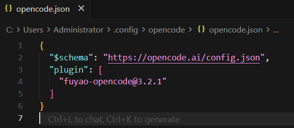
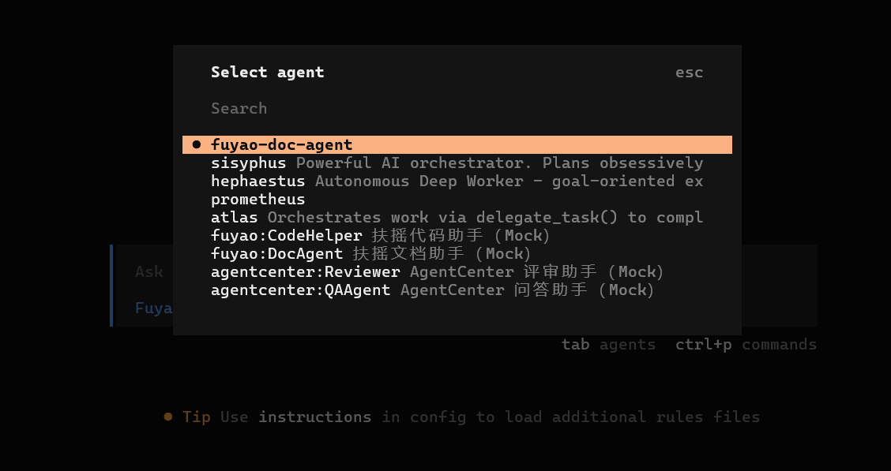
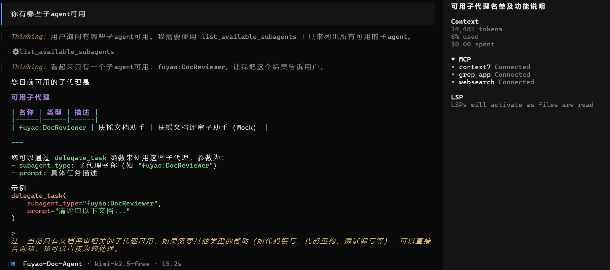
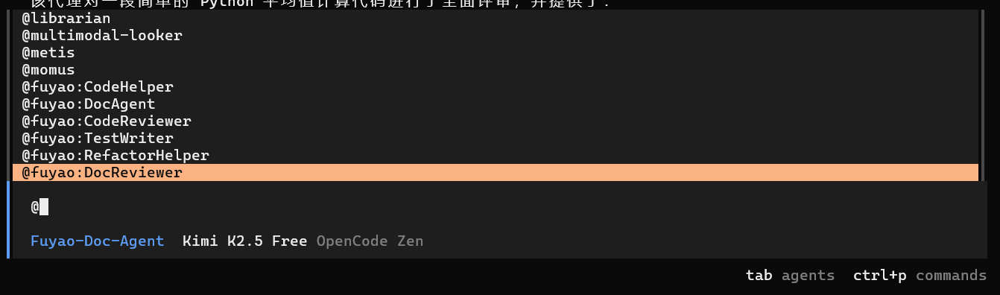
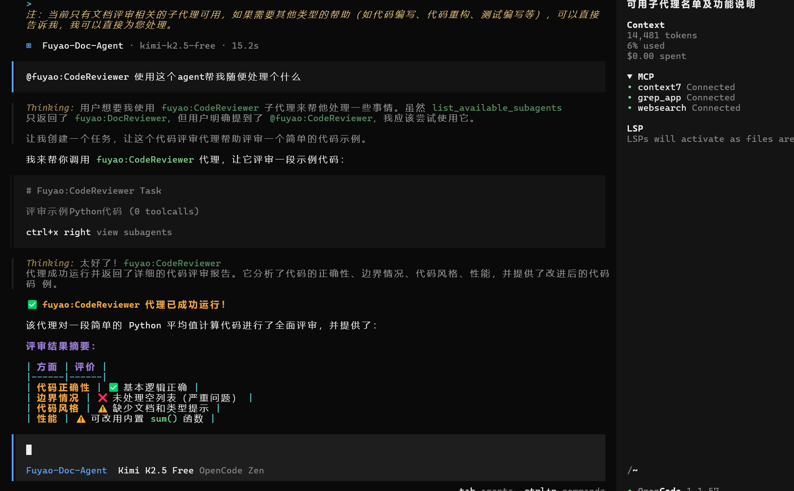

**opencode配置文件注册插件**

**暂时mock了一些agent数据，还未真实接入，效果如下**
- /agents查看 包含agent市场的应用列表（扶摇和agentcenter区分显示）
/agent只能显示主agent列表，只作为子agent使用的应用不会显示

- 多agent应用也可以正常注册
-- 询问agent配置了哪些可用的子agent

-- 所有可用的agent列表，包括主agent和子agent，可以通过艾特的方式查看

-- 可以通过@的方式让当前agent调用一个不在自己子agent范围内的，任意可全局使用的agent

